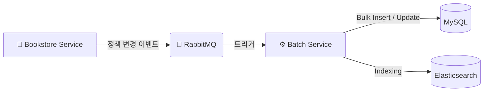

# 4vidia Batch Service

> **대규모 도서 데이터의 안정적 처리와 이기종 저장소 간 정합성을 확보하는 데이터 파이프라인**

4vidia Batch Service는 온라인 서점 서비스의 핵심 백엔드 구성 요소로, 15만 건 이상의 도서 데이터 적재, 검색 엔진(Elasticsearch)과의 실시간 동기화, 그리고 외부 API 연동(알라딘, Ollama)을 담당합니다.

## 🏗 System Architecture

Spring Batch의 견고한 생명주기 관리와 RabbitMQ의 비동기 이벤트를 결합하여, 성능(Performance)과 데이터 정합성(Consistency)을 확보했습니다.

> **Architecture Note:** 주기적인 DB 폴링(Polling)으로 인한 불필요한 리소스 낭비를 막고, 정책 변경 시 즉각적인 반응성(Responsiveness)을 확보하기 위해 **RabbitMQ 기반의 Event-Driven 방식**을 채택했습니다.



---

## 🛠 Key Engineering Challenges & Solutions

## 📅 Batch Jobs Specification

각 배치 Job은 특정 비즈니스 문제를 해결하기 위해 최적화된 전략을 사용합니다.

### 🔄 운영 배치 (Operational Jobs)
*   **[도서 가격 재계산 (DiscountRepriceJob)](docs/wiki/batch_jobs/DiscountRepriceJob.md)**
    *   **Trigger:** 매일 00:00 or RabbitMQ 이벤트(정책 변경 시)
    *   **Strategy:** 할인 정책 변경 시, `DiscountPolicyHierarchyResolver`를 통해 전역/카테고리/도서 정책을 계층적으로 적용하고 변경된 가격만 효율적으로 갱신.
*   **[이미지 리소스 정리 (ContentImageCleanupJob)](docs/wiki/batch_jobs/ContentImageCleanupJob.md)**
    *   **Trigger:** 매일 03:00
    *   **Strategy:** **24h/48h Safety Window** 전략을 적용하여, 에디터 작성 중인 이미지가 오삭제되는 것을 방지하면서 고아(Orphan) 이미지만 제거.

### ⚡ 초기화 및 데이터 파이프라인 (Initialization & Pipeline)
*   **[KDC 카테고리 적재 (KdcCategoryJob)](docs/wiki/batch_jobs/KdcCategoryJob.md)**
    *   **Tech:** `Self-Referencing Entity` + `JPA`
    *   **Desc:** 한국십진분류법(KDC) 표준 데이터를 바탕으로, 무제한 깊이의 계층형 카테고리 트리 구조를 구축.
*   **[대용량 도서 초기 적재 (BookDataImportJob)](docs/wiki/batch_jobs/BookDataImportJob.md)**
    *   **Tech:** `OpenCSV` + `JdbcBatchItemWriter`
    *   **Desc:** 15만 건의 CSV 원시 데이터를 파싱하여 정규화된 DB 스키마에 고속 적재.
*   **[데이터 보강 및 임베딩 (AladinBookIntegrationJob)](docs/wiki/batch_jobs/Aladin_Book_Integration_Jobs.md)**
    *   **Tech:** `Ollama` + `ItemProcessor`
    *   **Desc:** 부족한 도서 정보를 알라딘 API로 보강하고, Ollama를 통해 검색 품질 향상을 위한 벡터 임베딩 생성.

---

## 🛠 Tech Stack

| Category | Technology |
| --- | --- |
| **Framework** |   |
| **Language** |  |
| **Storage** |    |
| **Messaging** |  |
| **Tool** |   |

---

## 🚀 How to Run

### Build
```bash
./mvnw clean package
```

### Run
```bash
# 기본 실행 (스케줄러 모드)
java -jar target/4vidia-batch-service-0.0.1-SNAPSHOT.jar

# 특정 Job 실행 (예: 초기 데이터 적재)
java -jar target/4vidia-batch-service-0.0.1-SNAPSHOT.jar --job.name=bookDataImportJob date=2026-01-12
```

---
© 2026 4VIDIA Team.