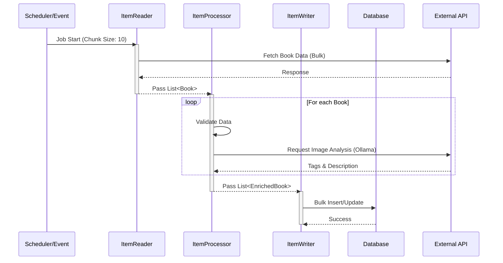

# Architecture & Batch Flow

## 데이터 파이프라인 흐름도 (Data Pipeline Flow)
Spring Batch의 Chunk 지향 처리 모델을 기반으로 한 데이터 흐름입니다.

## 시스템 구성요소
- **Scheduler**: Quartz 또는 RabbitMQ 이벤트를 통해 배치를 트리거합니다.
- **Reader**: JPA Paging 또는 외부 API 연동을 통해 데이터를 읽어옵니다.
- **Processor**: 데이터를 가공하거나 외부 AI(Ollama)를 호출하여 정보를 보강합니다.
- **Writer**: 가공된 데이터를 DB에 저장하거나 메시지 큐로 발행합니다.
