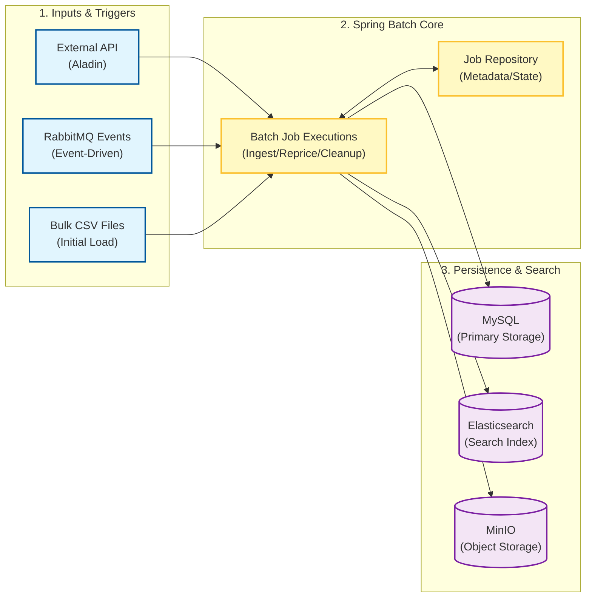

# 시스템 아키텍처 및 기술적 의사결정

## 1. System Overview

**4vidia Batch Service**는 대용량 도서 데이터를 안정적으로 처리하고, 시스템 간 데이터 정합성을 유지하기 위한 **Spring Batch 기반의 백엔드 애플리케이션**입니다.

단순한 작업 스케줄러(Cron)를 넘어, 대규모 데이터의 **수집(Ingestion), 가공(Processing), 적재(Loading)**를 담당하며, 실패 지점 관리와 트랜잭션 보장을 통해 데이터의 신뢰성을 확보하는 것을 목표로 합니다.

## 2. High-Level Context

시스템은 **데이터 소스(Input)**, **배치 처리 코어(Core)**, **데이터 저장소(Output)**의 3계층으로 구성됩니다.

## 3. Key Architecture Patterns (핵심 아키텍처 패턴)

### 3.1. Chunk-Oriented Processing (청크 지향 처리)
수십만 건의 데이터를 메모리에 모두 로드하지 않고, 설정된 크기(`Chunk Size`)만큼 끊어서 읽고(Read) 처리(Process)한 뒤 트랜잭션을 커밋(Write)합니다.
*   **구현**: `Fetched (50)` / `Enriched (80)` 등 작업 성격에 따라 최적화된 청크 사이즈를 적용하여 OOM(Out Of Memory) 방지 및 처리 속도를 조절합니다.

### 3.2. Event-Driven Batch (이벤트 구동 배치)
정해진 시간(Cron)에만 실행되는 전통적인 배치의 한계를 극복하기 위해, 비즈니스 이벤트 발생 시 즉시 배치를 실행하는 **하이브리드 트리거** 방식을 채택했습니다.
*   **구현**: RabbitMQ의 `DiscountPolicyChangedEvent`를 리스닝하는 Consumer가 `DiscountRepriceJob`을 즉시 실행하여, 정책 변경 사항을 실시간에 가깝게 반영합니다.

### 3.3. Fault Tolerance (장애 허용)
외부 시스템(알라딘 API, MinIO)의 일시적 장애가 전체 배치 실패로 이어지지 않도록 방어 로직을 구축했습니다.
*   **Retry**: 네트워크 타임아웃 등 일시적 오류 시, 설정된 횟수(2~3회)만큼 재시도 후 복구합니다.
*   **Skip**: 데이터 파싱 오류 등 복구 불가능한 개별 항목 오류는 건너뛰고(Skip), 나머지는 정상 처리하여 배치의 연속성을 보장합니다.

## 4. Technical Decisions (기술적 의사결정 - ADR)

### 4.1. Why Spring Batch?
단순 루프나 스크립트가 아닌 Spring Batch 프레임워크를 도입한 이유는 다음과 같습니다.
*   **State Management**: `Batch_Job_Execution` 등의 메타 테이블을 통해 작업의 성공/실패 지점을 자동으로 기록하여, 장애 발생 시 **중단된 지점부터 재시작(Restartability)**이 가능합니다.
*   **Transaction Management**: Chunk 단위의 트랜잭션 관리를 프레임워크 레벨에서 지원하여, 데이터 일관성을 쉽게 유지할 수 있습니다.

### 4.2. Why JDBC Batch Updates?
ORM(JPA)의 `saveAll` 사용 시 발생하는 성능 저하(N+1 Insert)를 해결하기 위함입니다.
*   **설정**: `rewriteBatchedStatements=true` 옵션과 `JdbcBatchItemWriter`를 사용하여, 수천 건의 Insert/Update 쿼리를 단일 네트워크 패킷으로 묶어 전송함으로써 쓰기 성능을 극대화했습니다.

### 4.3. Why Dual Storage (MySQL + Elasticsearch)?
*   **책임 분리**:
    *   **MySQL**: 관계형 데이터의 원본 저장 및 트랜잭션 처리를 담당합니다.
    *   **Elasticsearch**: 형태소 분석, 복합 필터링 등 고성능 검색 기능을 담당합니다.
*   Batch Service는 이 두 저장소 간의 데이터 싱크(Sync)를 맞추는 파이프라인 역할을 수행합니다.

### 4.4. External API Strategy (Rate Limiting)
알라딘 API의 엄격한 호출 제한(Rate Limit)을 우회하기 위해 **Multi-Key Rotation** 전략을 사용합니다.
*   8개의 API 키를 리스트로 관리하며, 요청 시마다 키를 순환(`Round Robin`)시켜 단일 키의 쿼터 소진을 방지하고 수집 가용성을 확보했습니다.

