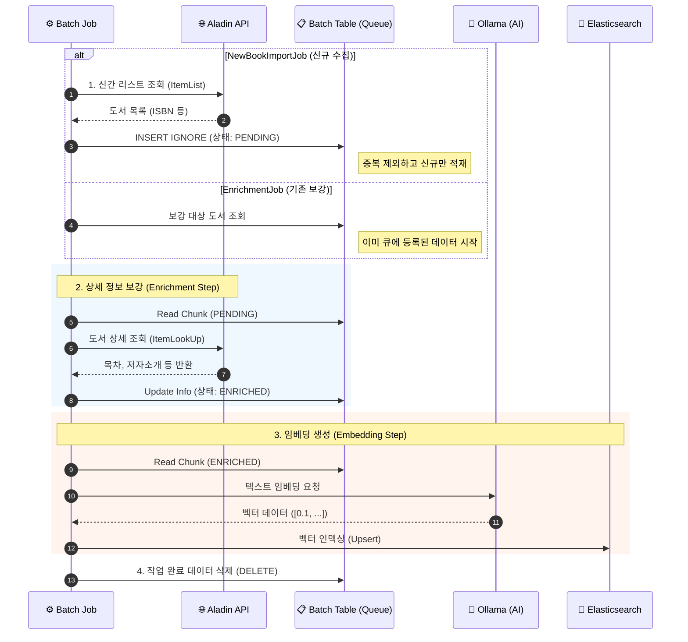

# 알라딘 도서 데이터 통합 파이프라인
> **대상 Job:** `AladinNewBookImportJob` (신규 수집), `AladinEnrichmentJob` (기존 데이터 보강)

## 🎯 개요 (Overview)
이 문서는 알라딘 API를 활용하여 도서 데이터를 수집하고, AI 임베딩을 통해 데이터를 고도화하는 **두 가지 상호 보완적인 배치 작업**을 설명합니다.

*   **`AladinNewBookImportJob`**: 외부(알라딘)에서 **신규 데이터**를 가져오는 **Full Pipeline**입니다.
*   **`AladinEnrichmentJob`**: 내부 DB에 이미 존재하지만 정보가 불완전한 데이터를 위한 **Repair/Upgrade Pipeline**입니다.

---

## 🔄 프로세스 흐름 (Sequence)

두 Job은 **초기 데이터 적재 방식**만 다르고, 이후의 **데이터 보강 및 임베딩 파이프라인**은 공유합니다.

---

## 🛠 상세 구성 요소 (Detailed Components)

### 1. 신규 수집 단계 (Aladin Fetch Step)
> *Only used in `AladinNewBookImportJob`*
*   **역할**: 알라딘 `ItemList` API를 호출하여 최신 신간 도서 목록을 수집합니다.
*   **핵심 로직**:
    *   **중복 방지**: DB 수준에서 ISBN 중복을 방지하기 위해 `INSERT IGNORE` 방식을 사용합니다. 이미 존재하는 도서는 무시되고, 신규 도서만 `Batch` 테이블에 `PENDING` 상태로 등록됩니다.
    *   **쿼터 제어**: `AladinQuotaTracker`를 통해 API 호출량을 모니터링합니다.

### 2. 상세 보강 단계 (Aladin Enrichment Step)
> *Shared by both Jobs*
*   **역할**: `Batch` 테이블에서 `PENDING` 상태인 데이터를 읽어 `ItemLookUp` API를 통해 상세 정보(목차, 저자 소개 등)를 채워 넣습니다.
*   **작동 방식**:
    *   **NewBookImportJob**: 1단계에서 적재된 신규 데이터를 대상으로 수행.
    *   **EnrichmentJob**: DB에 이미 존재하지만 보강이 필요한(Batch 레코드가 생성된) 데이터를 대상으로 수행.

### 3. 임베딩 생성 단계 (Embedding Enrichment Step)
> *Shared by both Jobs*
*   **역할**: 도서의 상세 정보를 분석하여 벡터 검색을 위한 임베딩을 생성하고 Elasticsearch에 저장합니다.
*   **장애 허용**: 임베딩 생성(AI 호출)은 외부 의존성이 크므로, 특정 아이템 실패 시 해당 건만 스킵하고 로그를 남기는 `FaultTolerant` 설정이 적용되어 있습니다.

### 4. 정리 단계 (Batch Cleanup Step)
*   **역할**: 모든 프로세스(보강, 임베딩)가 성공적으로 완료된 `Batch` 테이블의 레코드를 삭제합니다.
*   **이유**: `Batch` 테이블은 처리 대상을 관리하는 임시 큐 역할을 하므로, 작업 완료 후 데이터를 삭제하여 DB 크기를 일정하게 유지합니다. (도서 원본 데이터는 `Book` 테이블에 보존됩니다.)