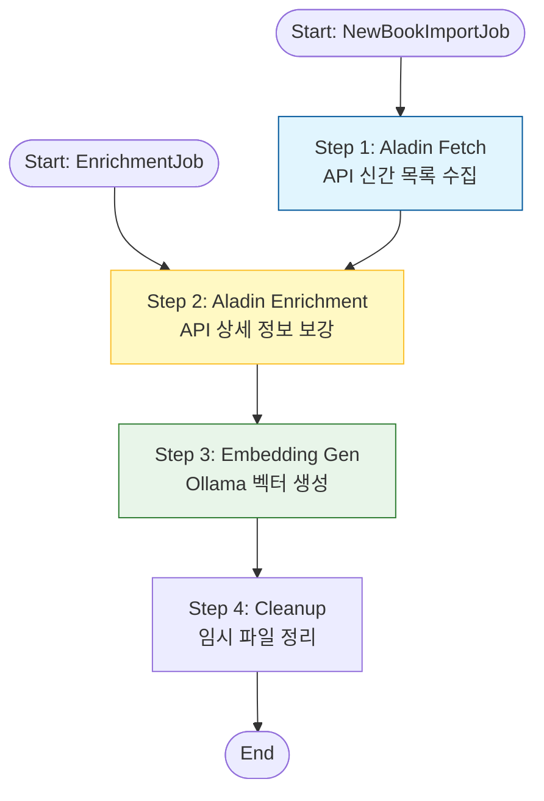

# 알라딘 도서 데이터 통합 파이프라인
> **대상 Job:** `AladinNewBookImportJob` (신규 수집), `AladinEnrichmentJob` (기존 데이터 보강)

## 🎯 개요 (Overview)
이 문서는 알라딘 API를 활용하여 도서 데이터를 수집하고, AI 임베딩을 통해 데이터를 고도화하는 **두 가지 상호 보완적인 배치 작업**을 설명합니다.

*   **`AladinNewBookImportJob`**: 외부(알라딘)에서 **신규 데이터**를 가져오는 **Full Pipeline**입니다.
*   **`AladinEnrichmentJob`**: 내부 DB에 이미 존재하지만 정보가 불완전한 데이터를 위한 **Repair/Upgrade Pipeline**입니다.

---

## 🔄 프로세스 비교 (Workflow Comparison)
두 Job은 **Step을 공유**하지만 시작점이 다릅니다. `EnrichmentJob`은 `FetchStep`을 건너뛰고 바로 보강 단계로 진입합니다.

---

## 🛠 상세 구성 요소 (Detailed Components)

### 1. 신규 수집 단계 (Aladin Fetch Step)
> *Only used in `AladinNewBookImportJob`*
*   **역할**: 알라딘 `ItemList` API를 호출하여 최신 신간 도서 목록을 수집합니다.
*   **핵심 로직**:
    *   **중복 방지**: ISBN을 기준으로 이미 DB에 존재하는 도서는 필터링합니다.
    *   **쿼터 제어**: `AladinQuotaTracker`를 통해 API 호출량을 모니터링합니다.

### 2. 상세 보강 단계 (Aladin Enrichment Step)
> *Shared by both Jobs*
*   **역할**: 기본 정보만 있는 도서에 대해 `ItemLookUp` API를 호출하여 상세 정보(목차, 저자 소개, 고화질 표지 등)를 채워 넣습니다.
*   **작동 방식**:
    *   **NewBookImportJob**: 방금 수집된(메모리 상의) 신규 도서 객체를 대상으로 수행.
    *   **EnrichmentJob**: DB에서 '상세 정보가 없는(description is null)' 도서를 읽어와서 수행.

### 3. 임베딩 생성 단계 (Embedding Enrichment Step)
> *Shared by both Jobs*
*   **역할**: 도서의 `description`이나 `title`을 분석하여 **벡터 검색(Vector Search)**을 위한 임베딩을 생성합니다.
*   **기술 스택**:
    *   **Model**: `bge-m3` (via Ollama)
    *   **Vector DB**: Elasticsearch (Dense Vector Field)
*   **장애 격리**: 임베딩 생성에 실패하더라도 도서 정보 저장은 성공하도록 `FaultTolerant` 처리가 되어 있습니다.

---

## 💡 왜 이렇게 설계했나요? (Architectural Decision)
1.  **재사용성 (Reusability)**:
    *   핵심 로직인 "보강(Enrichment)"과 "임베딩(Embedding)"을 별도 Step으로 모듈화하여, 신규 수집뿐만 아니라 기존 데이터의 품질 개선 작업에도 똑같이 사용할 수 있게 만들었습니다.
2.  **유연성 (Flexibility)**:
    *   API 장애로 인해 상세 정보를 못 가져온 경우, 전체를 다시 받을 필요 없이 `AladinEnrichmentJob`만 돌려서 **실패한 부분만 복구**할 수 있습니다.