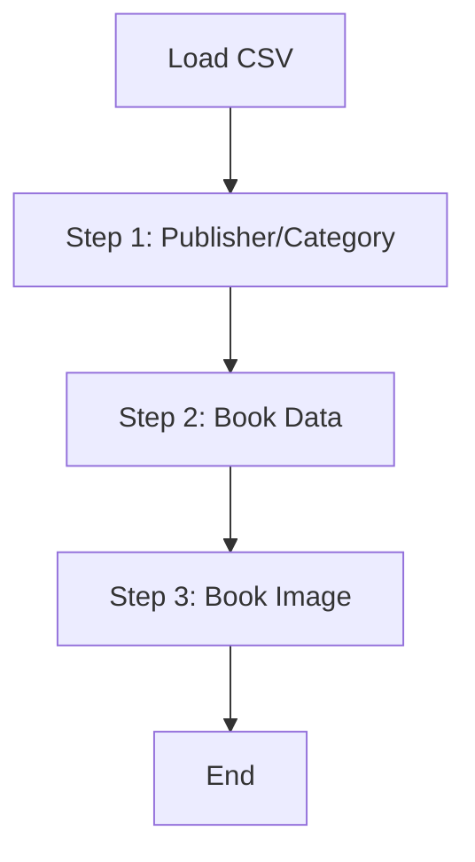

# 대용량 도서 초기 적재 (BookDataImportJob)

## 🎯 목적 (Goal)
서비스 오픈 초기 또는 테스트 환경 구축 시, 수십만 건의 도서 데이터를 CSV 파일로부터 신속하게 적재합니다.

## 🔄 프로세스 흐름 (Flow)

## 🛠 구성 요소 (Components)

### Step 1: 참조 데이터 처리 (`csvAndPublisherStep`)
*   **역할**: 출판사(Publisher)와 카테고리(Category) 등 참조 무결성이 필요한 데이터를 먼저 적재합니다.
*   **캐싱**: 이후 단계에서의 조회 성능을 위해 `InMemoryReferenceDataCache`에 로딩합니다.

### Step 2: 도서 데이터 처리 (`bookProcessingStep`)
*   **역할**: 실제 도서 정보를 적재합니다.
*   **최적화**: `rewriteBatchedStatements=true` 옵션과 JDBC Batch Insert를 사용하여 초당 처리량을 극대화했습니다.

### Step 3: 이미지 처리 (`bookImageStep`)
*   **역할**: 도서와 연관된 이미지 정보를 테이블에 저장합니다.

## 💡 주요 구현 포인트
*   **참조 무결성 보장**: 외래키 제약 조건을 만족시키기 위해 데이터 적재 순서를 엄격하게 설계했습니다.
*   **메모리 캐시**: 반복적인 DB 조회를 피하기 위해 자주 사용되는 참조 데이터(출판사 등)를 메모리에 캐싱하여 속도를 획기적으로 개선했습니다.
