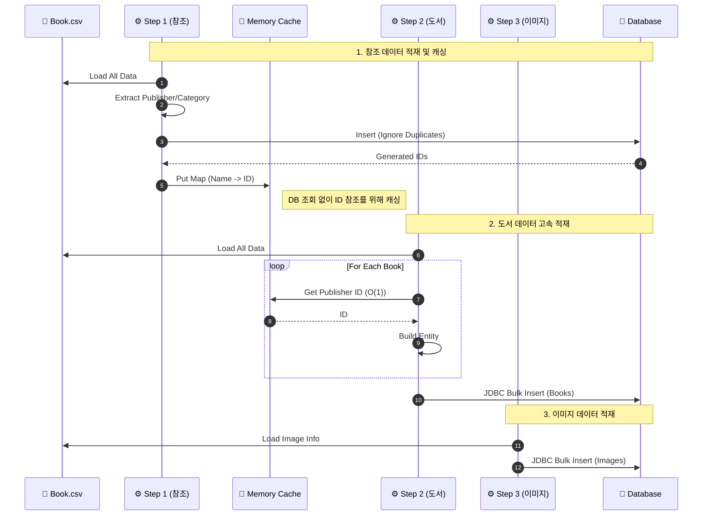

# 대용량 도서 초기 적재 (BookDataImportJob)

## 🎯 목적 (Goal)
서비스 오픈 초기 또는 테스트 환경 구축 시, 수십만 건의 도서 데이터를 CSV 파일로부터 신속하게 적재합니다.

## 🔄 프로세스 흐름 (Sequence)

데이터 간의 참조 무결성(FK)을 지키고 속도를 극대화하기 위해, **참조 데이터 캐싱 후 본 데이터 적재** 순서로 진행됩니다.

## 🛠 구성 요소 (Components)

### Step 1: 참조 데이터 처리 (`csvAndPublisherStep`)
*   **역할**: 출판사(Publisher)와 카테고리(Category) 등 참조 무결성이 필요한 데이터를 먼저 적재합니다.
*   **캐싱**: 이후 단계에서의 조회 성능을 위해 `InMemoryReferenceDataCache`에 로딩합니다.

### Step 2: 도서 데이터 처리 (`bookProcessingStep`)
*   **역할**: 실제 도서 정보를 적재합니다.
*   **최적화**: `rewriteBatchedStatements=true` 옵션과 JDBC Batch Insert를 사용하여 초당 처리량을 극대화했습니다.

### Step 3: 이미지 처리 (`bookImageStep`)
*   **역할**: 도서와 연관된 이미지 정보를 테이블에 저장합니다.

## 💡 주요 구현 포인트 (Technical Highlights)
*   **JDBC Batch 최적화**: `rewriteBatchedStatements=true` 옵션과 커스텀 `JdbcExecutor`를 활용한 Bulk Insert로 초당 수천 건의 쓰기 성능을 확보했습니다.
*   **참조 무결성 보장**: 외래키 제약 조건을 만족시키기 위해 데이터 적재 순서를 엄격하게 설계했습니다.
*   **메모리 캐시**: 반복적인 DB 조회를 피하기 위해 자주 사용되는 참조 데이터(출판사 등)를 메모리에 캐싱하여 속도를 획기적으로 개선했습니다.

## 🏗 설계 의도 (Architecture Decision)
### 왜 Chunk가 아닌 Tasklet인가?
Spring Batch의 표준인 Chunk 지향 처리(Reader-Processor-Writer) 대신 **Tasklet 패턴**을 사용했습니다.
1.  **초기 적재의 특수성**: 이 Job은 서비스 오픈 전 1회성으로 수행되며, 대상 데이터(CSV 15만 건)의 크기가 고정되어 있습니다.
2.  **속도 최우선**: 전체 데이터를 메모리에 올려두고(`In-Memory`) 처리함으로써 I/O 비용을 최소화하고 가장 빠른 속도로 적재하기 위함입니다.
3.  **학습 및 실험**: 대량 데이터 처리 시 메모리 기반 접근법의 효율성과 한계를 실험해보기 위한 목적도 있습니다.

## ⚠️ 제약 사항 및 확장 전략 (Constraints & Scalability)
*   **메모리 점유**: 모든 데이터를 힙 메모리에 로드하므로 데이터 양에 비례해 메모리 사용량이 증가합니다. 현재 규모(15만 건)에서는 안정적이나, 그 이상의 데이터 처리를 위해서는 아래와 같은 확장 전략이 필요합니다.
*   **확장 전략 (Future Improvements)**:
    1.  **캐시 구현체 교체**: 현재 인터페이스 기반으로 설계된 `ReferenceDataCache`를 활용하여, 로컬 메모리가 아닌 **Redis** 등을 사용하는 구현체로 교체함으로써 애플리케이션의 메모리 부하를 외부로 분산할 수 있습니다.
    2.  **Chunk 지향 처리**: `Tasklet` 방식을 `ItemReader/Writer` 기반의 **Chunk 지향 모델**로 전환하여 메모리 점유율을 낮게 유지하며 대량 데이터를 스트리밍 처리할 수 있습니다.
