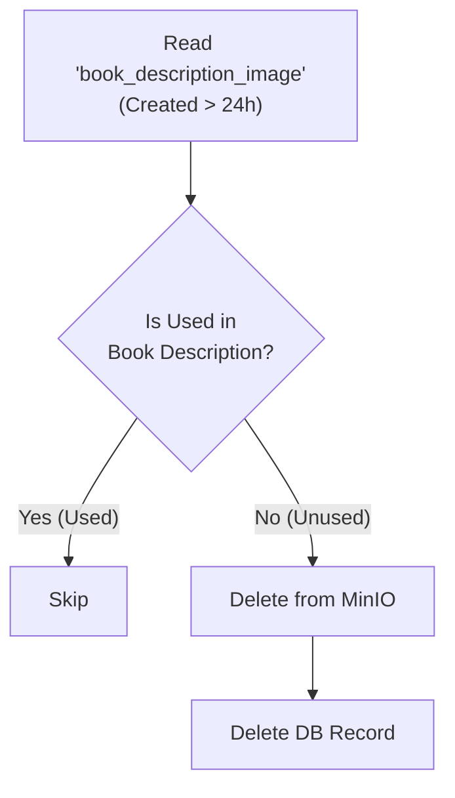

# 이미지 리소스 정리 (ContentImageCleanupJob)

## 🎯 목적 (Goal)
도서 등록/수정 시 WYSIWYG 에디터를 통해 업로드되었으나, 최종적으로 도서 설명(Content)에 포함되지 않은 '임시 이미지(Temporary Image)'를 정리합니다. 이를 통해 Object Storage(MinIO) 비용을 절감하고 불필요한 데이터를 제거합니다.

## 🔄 프로세스 흐름 (Flow)

## 🛠 구성 요소 (Components)

### 1. Chunk 지향 처리 (Chunk-Oriented)
*   **구조**: 대량의 이미지 로그를 처리하기 위해 `Reader` -> `Processor` -> `Writer`의 표준 Chunk 모델을 사용합니다.
*   **Chunk Size**: 100건 단위로 트랜잭션을 처리합니다.

### 2. 단계별 로직
*   **Reader (`JdbcPagingItemReader`)**:
    *   `book_description_image` 테이블에서 생성된 지 **24시간이 지난** 이미지 기록을 조회합니다.
    *   (24시간은 에디터 작성 시간을 고려한 버퍼입니다.)
*   **Processor (`ContentImageCleanupProcessor`)**:
    *   **검증**: 조회된 이미지 URL이 실제 도서의 `description` 본문에 포함되어 있는지 검사합니다.
    *   **최적화**: 성능을 위해 최근 48시간 내에 수정된 도서의 본문(`recentDescriptions`)을 메모리에 미리 로드하여 매칭합니다.
*   **Writer (`ContentImageCleanupWriter`)**:
    *   검증 결과 사용되지 않는 이미지로 판명되면 **MinIO(S3)**에서 파일을 물리적으로 삭제합니다.
    *   동시에 `book_description_image` 테이블에서도 해당 로그를 삭제합니다.

## 💡 주요 구현 포인트 & 주의사항
*   **메모리 최적화**: 매 건마다 DB를 조회하는 대신, 최근 변경된 도서 본문을 메모리에 캐싱하여 조회 성능을 높였습니다.
*   **주의사항 (Risk)**: 현재 로직은 **최근 48시간 내 수정된 도서**만을 대상으로 이미지 사용 여부를 판단합니다. 만약 그 이전에 수정된 도서가 `book_description_image` 테이블의 이미지를 참조하고 있다면(데이터 불일치 발생 시), 해당 이미지가 오삭제될 가능성이 있습니다. (따라서 이 Job은 임시 이미지 테이블의 생명주기가 짧다는 가정 하에 동작합니다.)
