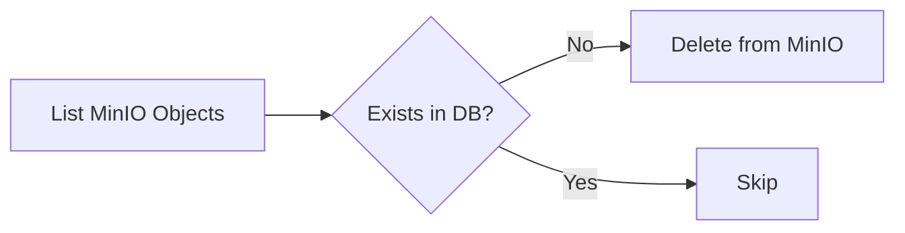

# 이미지 리소스 정리 (ContentImageCleanupJob)

## 🎯 목적 (Goal)
도서 삭제나 수정 과정에서 발생한 '고아 이미지(Orphan Image)'를 Object Storage(MinIO)에서 물리적으로 삭제하여 스토리지 비용을 절감하고 정합성을 유지합니다.

## 🔄 프로세스 흐름 (Flow)

## 🛠 구성 요소 (Components)

### 1. Tasklet 방식
*   **이유**: 단순한 파일 리스트 비교 작업이므로 복잡한 Reader-Writer 구조보다 Tasklet이 직관적입니다.
*   **로직**:
    1.  MinIO의 전체 파일 목록을 스트리밍으로 조회합니다.
    2.  DB의 `BookImage` 테이블에 해당 파일 경로가 존재하는지 확인합니다.
    3.  DB에 없는 파일은 삭제 API를 호출합니다.

## 💡 주요 구현 포인트
*   **안전 장치**: 실수로 인한 대량 삭제를 방지하기 위해 한 번 실행 당 최대 삭제 개수 제한(Safeguard)을 두었습니다.
