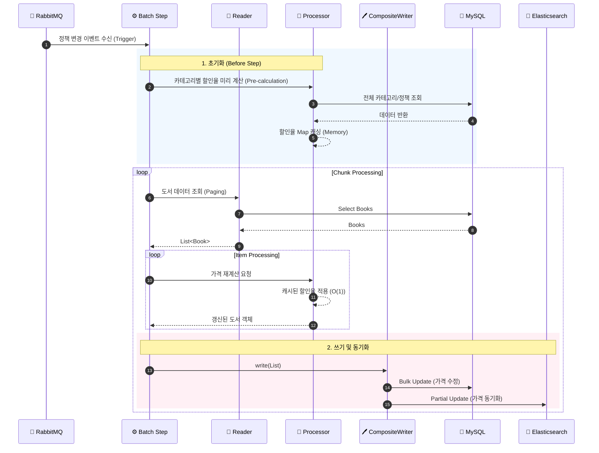

# 도서 가격 재계산 (DiscountRepriceJob)

## 🎯 목적 (Goal)
도서 할인 정책(카테고리별, 전역 정책 등)의 변경사항을 반영하여, 모든 도서의 최종 판매가(`salePrice`)를 갱신하고 **검색 엔진(Elasticsearch)과 실시간으로 동기화**합니다.

## 🔄 프로세스 흐름 (Sequence)

## 🛠 구성 요소 (Components)

### 1. Reader (`DiscountRepriceItemReader`)
*   **유연한 범위**: Job Parameter(`targetScope`, `categoryPath`)에 따라 전체 도서 또는 특정 카테고리 하위의 도서들만 선택적으로 처리할 수 있습니다.
*   **페이징 처리**: 대량 데이터를 안정적으로 처리하기 위해 JPA 기반 페이징 처리를 수행합니다.

### 2. Processor (`DiscountRepriceItemProcessor`)
*   **계층적 정책 해결**: `DiscountPolicyHierarchyResolver`를 통해 개별 카테고리 정책 -> 부모 카테고리 정책 -> 전역 정책 순으로 할인율을 결정합니다.
*   **성능 최적화**: 매 건마다 정책을 계산하지 않고, `beforeStep` 단계에서 **모든 카테고리의 할인율을 미리 계산(Pre-calculation)**하여 메모리 맵에 저장해둠으로써 처리 속도를 극대화했습니다.

### 3. Writer (`CompositeItemWriter`)
*   **DB 업데이트**: `JdbcExecutor`를 통해 변경된 판매가를 DB에 Bulk Update 합니다.
*   **ES 동기화 (`EsPriceUpdateWriter`)**: 검색 결과의 가격 정합성을 위해 Elasticsearch 인덱스의 `priceSales` 필드만 **부분 업데이트(Partial Update)** 합니다. 존재하는 문서만 골라서 업데이트하는 안전 로직이 포함되어 있습니다.

## 💡 주요 구현 포인트
*   **이중 저장소 동기화**: DB와 검색 엔진 간의 데이터 일관성을 배치 프로세스 내에서 보장합니다.
*   **결함 허용 (Fault Tolerance)**: Elasticsearch 네트워크 타임아웃 등 일시적인 외부 시스템 오류에 대해 **재시도(Retry) 로직**을 적용하여 배치 안정성을 높였습니다.
*   **도서정가제 준수**: `DiscountPriceCalculator`를 통해 법적 할인 한도를 초과하지 않도록 가격을 산출합니다.

## 🔮 Future Improvements & Trade-offs
*   **SPOF (Single Point of Failure)**: 현재 RabbitMQ가 단일 노드로 구성되어 있어 브로커 장애 시 이벤트 유실 가능성이 있습니다. 향후 **Clustering & Mirrored Queues** 도입을 통해 고가용성(HA)을 확보할 계획입니다.
*   **최종적 일관성 (Eventual Consistency)**: 메시지 유실이나 처리 실패에 대비하여, 매일 00:00에 실행되는 정기 배치(Full-Sync)가 데이터 정합성을 최종적으로 보장하는 **안전망(Safety Net)** 역할을 수행합니다.
