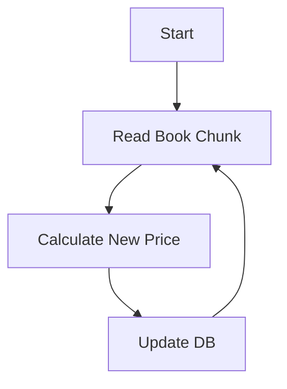

# 도서 가격 재계산 (DiscountRepriceJob)

## 🎯 목적 (Goal)
도서정가제 및 내부 할인 정책 변경사항을 반영하여, 매일 자정(00:00)에 모든 도서의 최종 판매가(`salePrice`)를 갱신합니다.

## 🔄 프로세스 흐름 (Flow)

## 🛠 구성 요소 (Components)

### 1. Reader (`JdbcPagingItemReader`)
*   **역할**: 전체 도서 데이터를 페이징 방식으로 효율적으로 읽어옵니다.
*   **성능**: `pageSize`와 `fetchSize` 튜닝을 통해 메모리 사용량을 최적화했습니다.

### 2. Processor (`DiscountRepriceProcessor`)
*   **로직**:
    *   기본 할인율과 카테고리별/프로모션별 추가 할인율을 적용합니다.
    *   도서정가제 법적 하한선(최대 10% 할인 + 5% 적립) 준수 여부를 검증합니다.

### 3. Writer (`JdbcBatchItemWriter`)
*   **역할**: 변경된 가격 정보를 DB에 일괄 업데이트합니다.
*   **최적화**: JDBC Batch Update를 활용하여 네트워크 왕복 횟수를 최소화했습니다.

## 💡 주요 구현 포인트
*   **대량 데이터 처리**: 수십만 건의 도서에 대해 트랜잭션 범위를 Chunk 단위로 쪼개어 처리함으로써 DB 락 점유 시간을 최소화했습니다.
