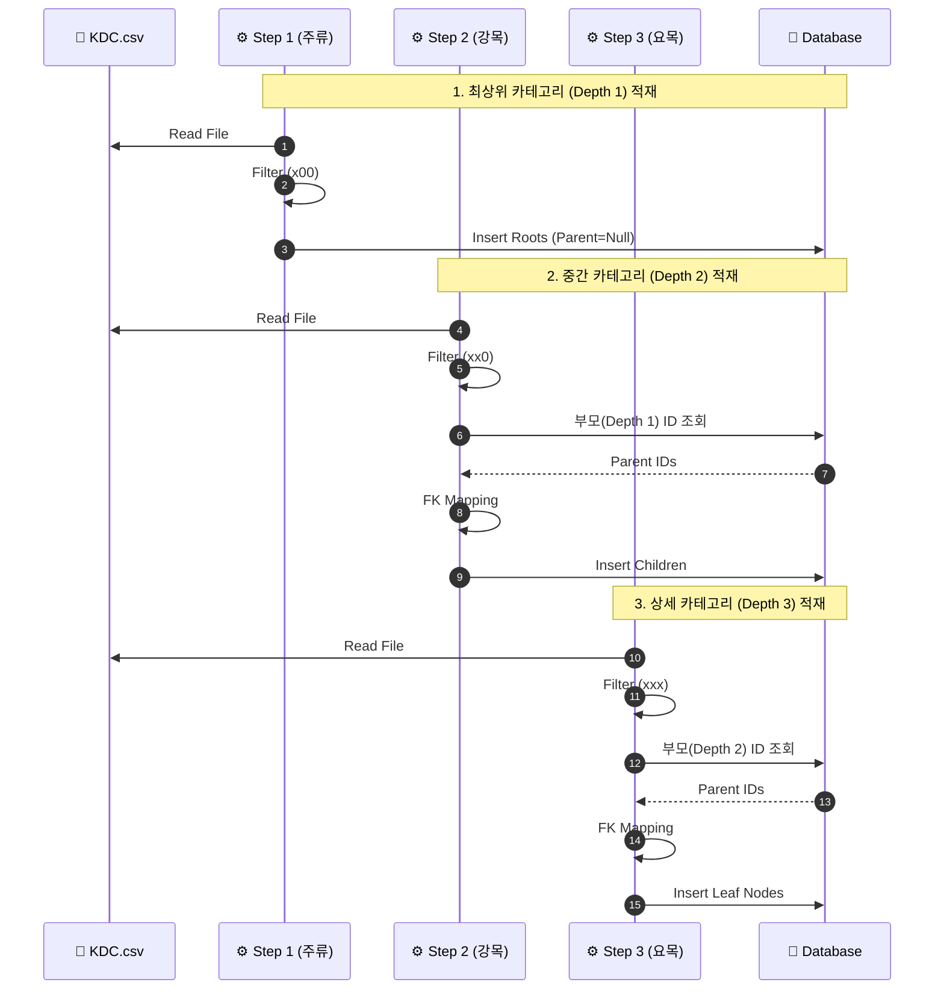

# KDC 카테고리 적재 (KdcCategoryJob)

## 🎯 설계 배경 (Design Background)

4VIDIA 서점은 도서 분류의 표준성과 정합성을 확보하기 위해 **한국십진분류법(KDC) 제6판**을 카테고리 체계로 채택했습니다.

### 1. 왜 KDC인가?
*   **표준 준수**: 자체 카테고리를 구축하는 대신 검증된 국가 표준 분류 체계를 사용하여 리소스를 절약하고 데이터 정합성을 확보합니다.
*   **독립성**: 특정 서점의 API에 종속되지 않는 독립적인 분류 시스템을 구축합니다.

### 2. 분류 범위: 요목(3자리)까지만 사용
도서관과 달리 온라인 서점은 검색을 통한 탐색이 주를 이루므로, 과한 세분화(소수점 이하 세목)를 피하고 **주류(100단위)-강목(10단위)-요목(1단위)**의 3단계 계층 구조만 사용합니다.
*   예: `123.456` (도서관) → `123` (4VIDIA)
*   분류 정보가 없는 도서는 UNC(Uncategorized)로 매핑됩니다.

---

## 🏗 데이터 구조 (Data Structure)

| 필드명 | 설명 | 예시 |
| :--- | :--- | :--- |
| **kdc_code** | KDC 분류 코드 (3자리) | `813` |
| **path** | 상위 카테고리를 포함한 전체 경로 | `/8/81/813` |
| **depth** | 계층 단계 (1:주류, 2:강목, 3:요목) | `3` |
| **parent_id** | 상위 카테고리 PK (Self-Referencing) | `81의 PK` |

---

## 🔄 프로세스 흐름 (Sequence)

상위 카테고리(Parent)가 먼저 존재해야 하위 카테고리를 연결할 수 있으므로, **3단계의 순차적 Step**으로 구성됩니다.

## 🛠 주요 구현 포인트 (Technical Highlights)

### 1. 계층별 Step 분리 (Step Partitioning)
*   **문제**: 동일 테이블 내 Self-Referencing FK 제약 조건 때문에 한 번에 모든 데이터를 넣을 수 없습니다.
*   **해결**: 하나의 CSV 파일을 3번 스캔하되, 각 Step에서 `ItemProcessor`를 통해 해당 Depth의 데이터만 필터링하여 순차적으로 적재합니다.

### 2. Path 기반 조회 최적화
*   카테고리 트리 구조를 탐색할 때 매번 재귀 쿼리를 날리는 대신, `path` 필드를 활용하여 하위 카테고리를 한 번의 쿼리로 효율적으로 조회할 수 있도록 설계했습니다.

### 3. 재시작 방지 (Prevent Restart)
*   카테고리 데이터는 정적인 기준 데이터(Reference Data)이므로, 작업 도중 실패 시 중복 적재 위험을 최소화하기 위해 `preventRestart()` 옵션을 활성화하여 Job의 무결성을 보장합니다.