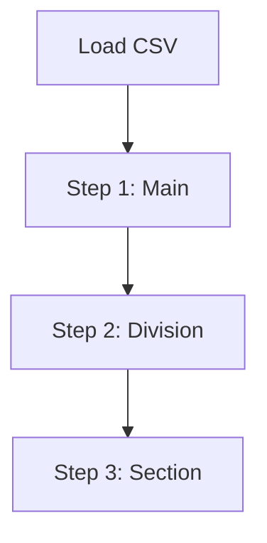

# KDC 카테고리 적재 (KdcCategoryJob)

## 🎯 목적 (Goal)
한국십진분류법(KDC) 데이터를 계층 구조(대분류 > 중분류 > 소분류)에 맞춰 DB에 적재합니다.

## 🔄 프로세스 흐름 (Flow)

## 🛠 구성 요소 (Components)

### 계층별 Step 분리
*   **이유**: 상위 카테고리가 먼저 존재해야 하위 카테고리를 연결할 수 있습니다 (Self-Referencing Foreign Key).
*   **구현**: 동일한 CSV 파일을 3번 읽지만, 각 Step마다 필터링 조건을 다르게 하여 계층 순서대로 적재합니다.

## 💡 주요 구현 포인트
*   **재시작 방지**: 데이터 중복 적재를 막기 위해 `preventRestart()` 옵션을 활성화했습니다.
